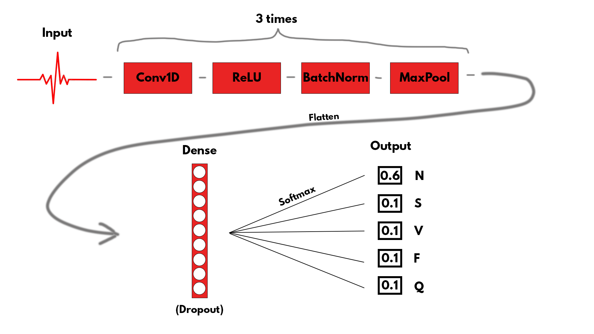

# ECG_analysis_ML

## Project Overview
This project focuses on automatic classification of ECG heartbeats using machine learning and deep learning methods. 
The goal is to compare classical baseline models with a deep learning approach and show how explicitly modeling time dependencies in ECG signals improves classification quality.

The project is based on the **MIT-BIH ECG Heartbeat Dataset** (Kaggle version), where each sample represents a single heartbeat described by 187 signal values.

—
## Part 0 (Piotr Ozga) - Visual Exploratory Data Analysis 

### Motivation 
The goal of this EDA is to analyze how different heartbeats look and how they differ from each other. We treat the ECG data as a time-series, not just random numbers. This approach helps us understand why simple classical models could be insufficient and why there is need to employ more advanced models like 1D-CNN. By visualizing the patterns, we can see if the differences between classes are temporal, which classical ML often fails to capture. 

### Data Preparation 
The preprocessing stage prepares the MIT-BIH dataset for comparative analysis by focusing on two main goals: 
- Format Conversion: The data is transformed into a long format. This is a technical requirement for data visualization to treat time as a continuous axis and plot the signals as waves. 
- Baseline & Statistics: I extract a *Normal* beat to serve as a morphological reference on all plots. I also calculate the mean and standard deviation for each class to represent their typical shapes and variability. 

### Morphological Comparative Analysis and Arrhythmia Distribution 
By overlaying representative exemplars of each class onto a Normal Reference, we can identify specific timing and shape deviations: 

Visual inspection of the ECG plots (**Fig. 1**) reveals characteristic shapes of heartbeat components, which traditional ML models - treating each point as an independent feature - fail to capture. Deep learning models, like 1D-CNNs, exploit the temporal structure and local patterns of the signal, significantly improving classification of rare arrhythmia types.  

In turn, distribution analysis (**Fig. 2**) highlights the internal imbalance among pathological samples. Minority classes like Supraventricular and Fusion are significantly underrepresented. This confirms that accuracy is an unreliable metric. We must prioritize the macro-F1 score and use weighted cross-entropy to ensure the model does not ignore these rare but critical cases.

### Analysis of Variability 
To ensure model generalization, we must assess how much each class varies internally. High internal variance often leads to feature overlap and training instability. **Fig 3** presents the statistical consistency of each arrhythmia. 

The shaded ribbons highlight significant intra-class variability. In turn, these fluctuations - especially in the Ventricular and Unclassified types - are responsible for potential instability in simpler architectures. Batch Normalization in the 1D-CNN could help to mitigate this instability by normalizing within each mini-batch, allowing the model to learn more reliably despite variability in the signals. 

### Autocorrelation Analysis (ACF) 
We use autocorrelation to check how a signal relates to itself over time. This helps us see the rhythm of each heartbeat. As shown in **Fig. 4** and **Fig. 5**, different classes have different temporal structures.  

The *Normal* beat has a specific signature that drops quickly. On the other hand, pathological classes show different patterns. For example, the Fusion class has a unique shape where correlation drops to zero and then rises again at the end. 

Some classes stay correlated much longer than others. These unique time-based shapes are responsible for why simple models may fail, as they do not understand these long-term relationships in the signal.  

### RMS Deviation Analysis 
To better understand the stability of our data, we need to measure the distance between individual signals and their group average. The RMS deviation reflects this variability, showing how much heartbeats differ from the typical pattern of their class.  

**Fig. 6** shows that the *Normal* rhythm and *Fusion* have lower average deviation. On the other hand, *Ventricular* and *Unclassified* show much higher RMS values and wider distributions (violin shapes). These high deviations are responsible for making the training difficult and suggest using models based on neural networks. If so, it probably won't work without Batch Normalization, which helps the model stay stable even when the signals are very different.  

### Conclusion of EDA 
The analysis shows that the dataset is complex because of its strong temporal rhythms and high internal noise. These factors are responsible for making the classification task difficult. These findings suggest that a robust approach like Deep Learning might be necessary, as simple models struggle with such diverse time-series data. 

The next section will test traditional machine learning methods to see if they can handle these challenges or if more advanced neural networks are required to achieve stable results. 

## Part 1 (Artsiom Tsiushnikau) – Data analysis + Baseline models

## Dataset
- Number of samples: ~109,000 heartbeats
- Sampling frequency: 125 Hz
- Input: 1D ECG signal (187 points per heartbeat)
- Output: heartbeat class (5 classes)

Classes:
- **0 (N)** – Normal beat 
- **1 (S)** – Supraventricular ectopic beat 
- **2 (V)** – Ventricular ectopic beat 
- **3 (F)** – Fusion beat 
- **4 (Q)** – Unknown / paced beat 

The dataset is highly imbalanced, normal beats dominate (about 75000 normal heartbeats against 24000 of all other classes). This makes evaluation and class handling an important part of the project.
The dataset is also already normalised. It doesn’t represent the absolute values of ECG in Htz, but the rescaled values from 0 to 1. We normalise it once again in order to obtain the distribution closer to Gauss distribution. This improves models performance.

---

## Baseline Machine Learning Models

### Motivation
Baseline models are not used to achieve the best possible performance. 
They serve as a **reference point** to show how much performance gain is obtained when switching to deep learning models. They also don’t treat the dataset as a time sequence.

### Methods
The following classical models were used:
- Logistic Regression
- Random Forest
- SGD-based linear classifier

Each heartbeat was treated as a fixed-length feature vector (187 values), without explicit modeling of temporal dependencies.

### Evaluation
- Main metric: **macro-F1 score** (due to class imbalance)
- Additional metrics: accuracy and confusion matrix

### Observations
- Baseline models achieved low accuracy (except for Random Forest).
- Overfitting on Random Forest (100% accuracy).
- Performance on rare classes (S and F) was limited.
- These results confirmed the need for models that can better capture signal dynamics.

---

## Part 2 (Diemid Rybchenko) – Deep Learning Model (1D Convolutional Neural Network)

### Motivation
ECG data is a time series, where the order and local patterns of signal values matter. 
Deep learning models, especially 1D convolutional networks, are well suited for this type of data.

### Preprocessing
- **Per-sample z-score normalization** was applied to each heartbeat 
(normalization done independently per sample, without data leakage).
- Class imbalance was handled using **weighted cross-entropy loss** with capped class weights.

### Model Architecture
- 1D Convolutional Neural Network (1D-CNN)
- 3 convolutional blocks with:
- Conv1D
- Batch Normalization
- ReLU activation
- Max Pooling
- Fully connected layers with dropout
- Output layer with 5 logits (one per class)

### Training Details
- Loss function: Cross-Entropy Loss with class weights
- Optimizer: Adam
- Learning rate scheduler: ReduceLROnPlateau
- Early stopping based on validation macro-F1
- Training performed on CPU (GPU used if available)

### Results
**Test set performance:**
- Accuracy: **~0.98**
- Macro-F1 score: **~0.91**

The deep learning model significantly outperformed baseline models, especially on minority classes.

### Error Analysis
- Confusion matrix analysis showed:
- Very good recognition of Normal (N), Ventricular (V), and Q beats
- Strong improvement for rare classes S and F compared to baseline models
- The use of capped class weights helped avoid over-predicting rare classes.

---

## Key Takeaways
- Baseline models are useful as a reference but are limited for time-series ECG data.
- Explicit modeling of temporal structure with 1D-CNN leads to a large performance improvement.
- Macro-F1 is a more appropriate metric than accuracy for imbalanced medical datasets.
- Proper normalization and class imbalance handling are crucial for good results.

---

## Conclusion
This project demonstrates that deep learning models designed for time-series data can significantly improve ECG heartbeat classification compared to classical machine learning approaches. 
The comparison with baseline models clearly shows the benefit of modeling temporal dependencies in biomedical signals.

—

## References

1) ECG and dataset

Goldberger et al., 2000
PhysioBank, PhysioToolkit, and PhysioNet: Components of a New Research Resource for Complex Physiologic Signals - original MIT-BIH Arrhythmia Database
Moody, Mark, 2001
The impact of the MIT-BIH Arrhythmia Database
IEEE Engineering in Medicine and Biology Magazine

2) Deep Learning

Kiranyaz et al., 2016
Real-Time Patient-Specific ECG Classification by 1D CNN
Rajpurkar et al., 2017
Cardiologist-Level Arrhythmia Detection with CNN

3) ML and metrics

Goodfellow, Bengio, Courville, 2016
Deep Learning, MIT Press
Powers, 2011
Evaluation: From Precision, Recall and F-measure to ROC. Journal of Machine Learning Technologies

4) Practices and instruments

Paszke et al., 2019
PyTorch: An Imperative Style, High-Performance Deep Learning Library NeuIPS
Pedregosa et al., 2011
Scikit-learn: Machine Learning in Python. Journal of Machine Learning Research

## Authors
- Diemid Rybchenko
- Artsiom Tsiushnikau
- Piotr Ozga

